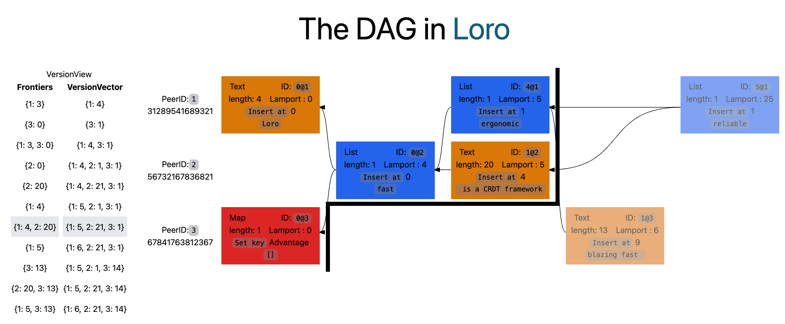

# The DAG in Loro

This demo is designed to showcase the version-related concepts in Loro, including `DAG`, `Change`, `VersionVector`, and `Frontiers`.  
You can hover over different versions to observe the relationship between `Frontiers` and `VersionVector`. For more information, refer to the [Loro documentation](https://www.loro.dev/docs/advanced/version_deep_dive).
